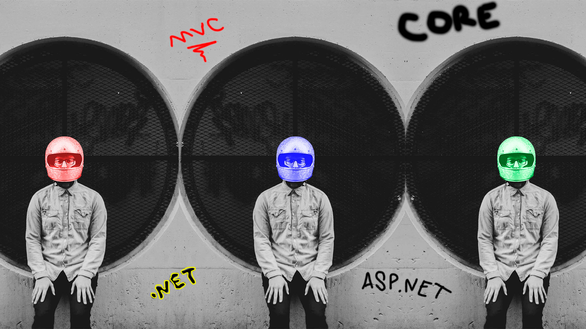
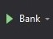

# Bank

<!-- Banner -->

    

<!-- First badges -->

  <!-- Codacy -->
 
  <!-- Last commit -->
  
  <!-- Repo size -->
  

<!-- Seconds badges -->

  <!-- Contributors -->
  
  <!-- Language -->
  
  <!-- License -->
  

## Using

-   .NET Core 3.1

## Get Started

## Notebook

-   [Notion](https://www.notion.so/Do-1-ao-39bcd0b07bf44139b85169c2432d9ceb)

* * *

Copyright © Mir Carvalho 2021
